# 🎮 GamePlan - Esports Manager Dashboard

<div align="center">


**The Future of Esports Management is Here** 🚀

[](https://nextjs.org/)
[](https://internetcomputer.org/)
[](https://www.rust-lang.org/)
[](https://www.typescriptlang.org/)

*Revolutionizing esports management with blockchain technology, AI-powered analytics, and stunning UI*

[🚀 Live Demo](#-live-demo) • [📖 Documentation](#-table-of-contents) • [🔧 Setup Guide](#-quick-start) • [🤝 Contributing](#-contributing)

</div>

---

## 🌟 What is GamePlan?

GamePlan is a **next-generation esports management dashboard** that combines the power of blockchain technology with modern web development to create the ultimate tool for esports managers and teams. Built specifically for the **Indonesian esports scene**, GamePlan offers unparalleled insights, security, and user experience.

### 🎯 Why GamePlan?

- **🔐 Bulletproof Security**: Your data lives on the Internet Computer blockchain - unhackable, uncensorable, unstoppable
- **🤖 AI-Powered Insights**: Get intelligent analytics specifically tailored for Indonesian esports trends
- **🎨 Beautiful Design**: Modern, responsive UI that doesn't compromise on functionality
- **⚡ Lightning Fast**: Built with Next.js and optimized for performance
- **🌐 Truly Decentralized**: No servers to maintain, no single point of failure

---

## 📸 Screenshots & Demos

### 🏠 Dashboard Overview

*Your command center for esports success*

### 🤖 AI Assistant

*Intelligent insights with beautiful data visualizations*

### 📱 Mobile Experience
<div align="center">

</div>

*Fully responsive design for management on the go*

---

## 🚀 Features

### 🎮 For Esports Managers

#### 📊 **Overview Dashboard**
- **Historical Analytics**: Deep dive into performance metrics across different time periods
- **Interactive Charts**: Dynamic graphs that update based on selected month/year
- **Key Performance Indicators**: Track what matters most to your team's success
- **Trend Analysis**: Spot patterns and opportunities in your data

#### 🤖 **AI-Powered Assistant**
- **Indonesian Esports Context**: Specialized knowledge about local gaming scene
- **Smart Analytics**: Ask questions, get intelligent insights
- **Visual Data Presentation**: Every AI response includes beautiful charts and graphs
- **Conversational Interface**: Natural language queries for complex data analysis

#### 🔐 **Secure Authentication**
- **Internet Identity Integration**: Passwordless login using Web3 standards
- **Consistent Principal IDs**: Your identity stays the same across sessions
- **Role-Based Access**: Granular permissions for different user types

### 👑 For Administrators

#### 👥 **User Management**
- **Whitelist Control**: Decide who gets access to your dashboard
- **Role Assignment**: Promote managers, assign permissions
- **User Analytics**: See who's active and how they're using the platform
- **Audit Trail**: Full history of user actions and changes

#### ⚙️ **System Control**
- **Decentralized Administration**: Manage everything through blockchain calls
- **No Server Maintenance**: Your backend runs on the Internet Computer
- **Automatic Backups**: Data persistence guaranteed by blockchain technology

---

## 🏗️ Architecture

### 🎨 Frontend (Web2 + Modern Tech)
```
Next.js 14 (App Router) + TypeScript
├── 🎨 UI Framework
│   ├── Shadcn/ui (Core Components)
│   ├── Aceternity UI (Advanced Animations)
│   └── Tailwind CSS (Styling)
├── 🔌 Web3 Integration
│   ├── Internet Identity (Auth)
│   ├── Agent-js (ICP Communication)
│   └── Candid (Type Safety)
└── 📊 Data Visualization
    ├── Recharts (Charts)
    ├── Framer Motion (Animations)
    └── Custom Components
```

### ⛓️ Backend (Fully Decentralized)
```
Internet Computer (ICP) Blockchain
├── 🦀 Rust Canister
│   ├── User Management
│   ├── Role-Based Access Control
│   ├── Data Storage & Retrieval
│   └── Business Logic
├── 🔐 Security Features
│   ├── Internet Identity Integration
│   ├── Principal-based Authentication
│   └── Cryptographic Signatures
└── 📡 APIs
    ├── Candid Interface
    ├── Query Functions
    └── Update Functions
```

### 🌐 Network Architecture

```mermaid
graph TB
    A[👤 User] --> B[🌐 Next.js Frontend]
    B --> C[🔐 Internet Identity]
    C --> D[⛓️ ICP Blockchain]
    D --> E[🦀 Rust Canister]
    E --> F[💾 Blockchain Storage]
    
    G[🤖 AI Assistant] --> H[📊 Data Processing]
    H --> I[📈 Chart Generation]
    I --> B
    
    J[👨‍💼 Admin] --> K[🛠️ Candid UI]
    K --> E
```


---

## 💻 Tech Stack

### Frontend Powerhouse 🎨
| Technology | Purpose | Why We Chose It |
|------------|---------|-----------------|
| **Next.js 14** | React Framework | Best-in-class developer experience, App Router, SSR |
| **TypeScript** | Type Safety | Catch errors early, better developer experience |
| **Tailwind CSS** | Styling | Utility-first, highly customizable, performance |
| **Shadcn/ui** | UI Components | Modern, accessible, customizable components |
| **Aceternity UI** | Advanced UI | Stunning animations and interactive elements |
| **Framer Motion** | Animations | Smooth, performant animations |
| **Recharts** | Data Visualization | React-native charts with great customization |

### Backend Beast ⛓️
| Technology | Purpose | Why We Chose It |
|------------|---------|-----------------|
| **Internet Computer** | Blockchain Platform | True decentralization, web-speed, cost-effective |
| **Rust** | Canister Language | Memory safety, performance, WebAssembly compilation |
| **Candid** | Interface Definition | Type-safe communication between frontend and backend |
| **Internet Identity** | Authentication | Passwordless, secure, Web3-native authentication |

### Development Tools 🛠️
| Tool | Purpose |
|------|---------|
| **DFX SDK** | ICP Development Kit |
| **Cargo** | Rust Package Manager |
| **pnpm** | Fast Package Manager |
| **ESLint + Prettier** | Code Quality |
| **VS Code Extensions** | Development Experience |

---

## 🚀 Quick Start

### 📋 Prerequisites

Before diving into the GamePlan universe, make sure you have:

```bash
# Node.js (v18 or higher)
node --version  # Should show v18+

# Rust and Cargo
rustc --version
cargo --version

# DFX SDK (Internet Computer)
dfx --version

# Git (for cloning)
git --version
```

### 🔧 Installation

#### 1️⃣ Clone the Repository
```bash
git clone https://github.com/yourusername/GamePlan.git
cd GamePlan
```

#### 2️⃣ Setup Backend (ICP Canister)
```bash
# Install WASM target for Rust
rustup target add wasm32-unknown-unknown

# Start local ICP network
dfx start --clean --background

# Deploy the backend canister
dfx deploy backend

# Setup initial admin (replace with your Principal ID)
dfx identity get-principal  # Copy this output
dfx canister call backend add_initial_admin '(principal "YOUR_PRINCIPAL_ID")'
```

#### 3️⃣ Setup Frontend (Next.js)
```bash
cd frontend

# Install dependencies
pnpm install

# Start development server
pnpm dev
```

#### 4️⃣ Access Your Dashboard
```bash
# Frontend: http://localhost:3000
# Backend Candid UI: Check dfx deploy output for URL
```

### 🎉 First Time Setup

1. **Create Internet Identity**: Visit the II URL and create your digital identity
2. **Login to GamePlan**: Use your new Internet Identity to log in
3. **Explore Dashboard**: Navigate through Overview and Assistant features
4. **Add Team Members**: Use admin functions to invite managers

---

## 📚 Detailed Setup Guide

### 🔧 Backend Development

#### Understanding ICP Canisters
Canisters are the smart contracts of the Internet Computer. Our backend canister handles:

- **User Authentication & Authorization**
- **Role-based Access Control**
- **Data Storage & Retrieval**
- **Business Logic Execution**

#### Key Functions
```rust
// Add initial admin (one-time setup)
dfx canister call backend add_initial_admin '(principal "PRINCIPAL_ID")'

// Add manager (admin only)
dfx canister call backend add_manager '(principal "MANAGER_PRINCIPAL")'

// Check user role
dfx canister call backend get_user_role

// Get all users (admin only)
dfx canister call backend get_all_users

// Remove user (admin only)
dfx canister call backend remove_user '(principal "USER_PRINCIPAL")'
```

#### Development Workflow
```bash
# Make changes to backend/src/lib.rs
# Rebuild and redeploy
cargo build --target wasm32-unknown-unknown --release
dfx deploy backend

# Test via Candid UI or CLI
dfx canister call backend FUNCTION_NAME
```

### 🎨 Frontend Development

#### Project Structure
```
frontend/
├── src/
│   ├── app/                    # Next.js App Router
│   │   ├── globals.css        # Global styles
│   │   ├── layout.tsx         # Root layout
│   │   ├── page.tsx           # Homepage
│   │   ├── dashboard/         # Dashboard pages
│   │   └── auth/              # Authentication pages
│   ├── components/
│   │   ├── ui/                # Shadcn/ui components
│   │   ├── aceternity/        # Aceternity components
│   │   └── custom/            # Custom components
│   ├── lib/
│   │   ├── utils.ts           # Utility functions
│   │   ├── icp.ts             # ICP connection logic
│   │   └── auth.ts            # Authentication helpers
│   ├── types/                 # TypeScript type definitions
│   └── hooks/                 # Custom React hooks
└── public/                    # Static assets
```

#### Adding New Components
```bash
# Add Shadcn/ui component
npx shadcn-ui@latest add button

# Component will be added to src/components/ui/
```

#### Environment Variables
The deployment process automatically generates `.env.local` with:
```bash
NEXT_PUBLIC_CANISTER_ID_BACKEND=your-canister-id
NEXT_PUBLIC_IC_HOST=http://127.0.0.1:4943  # Local development
```

---

## 🎮 Usage Guide

### 👤 For Managers

#### 📊 Dashboard Overview
1. **Select Time Period**: Use the dropdown to choose month/year
2. **Analyze Data**: View automatically updated charts and metrics
3. **Track Trends**: Compare performance across different periods
4. **Export Reports**: Download data for external analysis

#### 🤖 AI Assistant
1. **Ask Questions**: Type natural language queries about your data
2. **Get Insights**: Receive AI-powered analysis with context
3. **View Visualizations**: Every response includes relevant charts
4. **Save Insights**: Bookmark important findings for later

### 👑 For Administrators

#### 👥 User Management
1. **Access Candid UI**: Use the URL provided after deployment
2. **Add Managers**: Call `add_manager` function with Principal IDs
3. **Monitor Usage**: Check user activity and role assignments
4. **Maintain Security**: Regular audit of user permissions

#### 🔧 System Maintenance
1. **Update Canister**: Deploy new versions when needed
2. **Monitor Performance**: Check canister metrics
3. **Backup Strategy**: Leverage blockchain's built-in persistence

---

## 🌍 Deployment

### 🏠 Local Development
```bash
# Backend
dfx start --background
dfx deploy backend

# Frontend
cd frontend && pnpm dev
```

### 🌐 Production Deployment

#### Backend (Internet Computer Mainnet)
```bash
# Deploy to mainnet
dfx deploy --network ic backend

# Configure production environment
dfx canister --network ic call backend add_initial_admin '(principal "PROD_ADMIN")'
```

#### Frontend (Vercel/Netlify)
```bash
# Build for production
cd frontend
pnpm build

# Deploy to your preferred platform
# Update environment variables with mainnet canister IDs
```

### 🔧 Environment Configuration
```bash
# Production .env.local
NEXT_PUBLIC_CANISTER_ID_BACKEND=your-mainnet-canister-id
NEXT_PUBLIC_IC_HOST=https://ic0.app
```

---

## 🔐 Security

### 🛡️ Authentication Flow
1. **User initiates login** → Redirected to Internet Identity
2. **Biometric/device authentication** → User proves identity
3. **Principal ID generated** → Unique identifier per user per app
4. **Backend verification** → Canister checks user permissions
5. **Session established** → Secure access to dashboard

### 🔒 Data Protection
- **Blockchain Storage**: All data stored on-chain, immutable and secure
- **No Traditional Passwords**: Passwordless authentication reduces attack vectors
- **Cryptographic Signatures**: Every action cryptographically signed
- **Role-based Access**: Granular permissions prevent unauthorized access

### 🚨 Security Best Practices
- **Regular Audits**: Review user permissions regularly
- **Principle of Least Privilege**: Only grant necessary permissions
- **Monitor Activity**: Track user actions for suspicious behavior
- **Keep Updated**: Update dependencies and canister code regularly

---

## 🧪 Testing

### 🔬 Backend Testing
```bash
# Unit tests
cd backend
cargo test

# Integration tests via DFX
dfx start --background
dfx deploy backend
./scripts/test-backend.sh
```

### 🎭 Frontend Testing
```bash
cd frontend

# Unit tests
pnpm test

# E2E tests
pnpm test:e2e

# Type checking
pnpm type-check
```

### 📊 Test Coverage
- **Backend**: Unit tests for all business logic functions
- **Frontend**: Component tests and integration tests
- **E2E**: Critical user flows tested end-to-end

---

## 🤝 Contributing

We welcome contributions from the esports and Web3 communities! 

### 🚀 Getting Started
1. **Fork the repository**
2. **Create a feature branch**: `git checkout -b feature/amazing-feature`
3. **Make your changes**: Follow our coding standards
4. **Test thoroughly**: Ensure all tests pass
5. **Submit a pull request**: Describe your changes clearly

### 📝 Contribution Guidelines
- **Code Style**: Follow Rust and TypeScript best practices
- **Documentation**: Update README and code comments
- **Testing**: Add tests for new features
- **Security**: Consider security implications of changes

### 🐛 Bug Reports
Found a bug? Please open an issue with:
- **Description**: What happened vs. what you expected
- **Steps to Reproduce**: Detailed reproduction steps
- **Environment**: OS, browser, versions
- **Screenshots**: If applicable

### 💡 Feature Requests
Have an idea? We'd love to hear it! Open an issue with:
- **Use Case**: Why is this feature needed?
- **Proposed Solution**: How should it work?
- **Alternatives**: What other approaches did you consider?

---

## 📜 License

This project is licensed under the MIT License - see the [LICENSE](LICENSE) file for details.

---

## 🙏 Acknowledgments

### 🌟 Built With Love By
- **The GamePlan Team** - Passionate about esports and Web3
- **Internet Computer Community** - For the amazing blockchain platform
- **Indonesian Esports Scene** - For inspiration and feedback

### 🎯 Special Thanks
- **DFINITY Foundation** - For building the Internet Computer
- **Next.js Team** - For the amazing React framework
- **Rust Community** - For the powerful systems language
- **Shadcn** - For beautiful UI components
- **Aceternity** - For stunning UI animations

### 🏆 Powered By
- **Internet Computer Protocol (ICP)**
- **Next.js & Vercel**
- **Rust & WebAssembly**
- **Internet Identity**

---

## 📞 Support & Community

### 💬 Get Help
- **GitHub Issues**: For bugs and feature requests
- **Discord**: Join our community server
- **Documentation**: Comprehensive guides and tutorials
- **Stack Overflow**: Tag your questions with `gameplan-esports`

### 🌐 Stay Connected
- **Website**: [gameplan.gg](https://gameplan.gg) *(coming soon)*
- **Twitter**: [@GamePlanEsports](https://twitter.com/GamePlanEsports) *(coming soon)*
- **LinkedIn**: [GamePlan Official](https://linkedin.com/company/gameplan) *(coming soon)*
- **YouTube**: [GamePlan Tutorials](https://youtube.com/gameplan) *(coming soon)*

---

<div align="center">

## 🎮 Ready to Revolutionize Esports Management?

**[🚀 Get Started Now](#-quick-start)** • **[📖 Read the Docs](#-table-of-contents)** • **[🤝 Join the Community](#-support--community)**

---

*Built with ❤️ for the esports community*

**GamePlan** - *Where Strategy Meets Technology*


</div>
